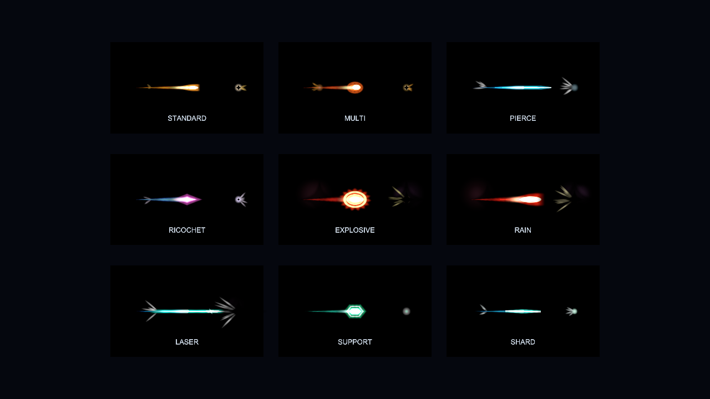

# 투사체 VFX 오버홀 — 시각 언어와 FTUE 이식 계약

작업 브랜치: `codex/projectile-vfx-overhaul`

## 목표

탄을 색이 다른 사각형이 아니라 `발사 → 비행 → 접촉 → 결과`가 한 문장으로 읽히는 무기 표현으로 만든다.
Enter the Gungeon의 총기별 실루엣 차이, Binding of Isaac의 중첩 특성 가시화, Deep Rock Galactic의 동굴을 밝히는 발사광을 현재 2D 다이메트릭 화면에 맞게 번역한다.

## 구현 문법

| 탄형 | 비행 실루엣 | 궤적·광원 | 접촉 피드백 |
|---|---|---|---|
| standard | 앞이 뜨거운 황동 슬러그 | 짧은 주황 꼬리 | 작은 별·역방향 스파크 |
| multi | 불규칙한 굵은 펠릿 | 짧고 넓은 적색 꼬리 | 여러 조각의 산탄 불꽃 |
| pierce | 가늘고 긴 청백색 바늘 | 긴 청색 꼬리·강한 우선 조명 | 진행 방향 관통 스파이크 |
| ricochet | 회전하는 보라 다이아몬드 | 긴 보라 꼬리 | 사각 파동·반사 방향 스파크 |
| explosive | 불안정한 적색 플라즈마 구 | 두꺼운 연소 꼬리·넓은 조명 | 이중 충격파·섬광·파편·연기 |
| rain | 꼬리가 두꺼운 화염 운석 | 긴 적갈색 꼬리 | 폭발과 방향성 파편 |
| laser | 백색 코어의 청록 빔 | 가장 긴 청색 꼬리·최우선 조명 | 청백 섬광·직선 스파이크 |
| support | 녹색 육각 에너지 셀 | 절제된 녹색 꼬리 | 작은 링, 낮은 화면 반동 |
| shard | 좁고 회전하는 결정 파편 | 청록/청색 혼합 꼬리 | 결정형 스파이크 |

`ProjectileStyleFlags`는 대표 탄형과 별도로 multi, pierce, ricochet, explosive 등을 보존한다. 따라서 관통+도탄이나 폭발+관통 빌드는 대표 색 하나로 덮이지 않고 길이, 폭, 꼬리색, 회전, 조명 우선순위가 함께 합성된다.

## 성능 경계

- 시뮬레이션 탄 수와 시각 탄 수를 분리한다. 시각 노드는 최대 96개다.
- Low/Medium/High/Ultra 궤적 상한은 20/40/64/80개다.
- 실제 Light2D 상한은 0/4/8/12개다. 나머지는 HDR 가산 외곽광으로 가독성을 유지한다.
- 한 노드는 네 SpriteRenderer, 한 TrailRenderer를 재사용한다.
- 머티리얼은 에너지/궤적 각 1개만 공유하며 탄마다 복제하지 않는다.
- MaterialPropertyBlock은 노드 생성 때 한 번 만들고 재사용한다.
- 기존 사격 샘플 위에 탄종별 피치와 절차 합성 레이어를 얹고, 도탄·관통·폭발 접촉음은 짧은 스로틀로 과밀 재생을 막는다.
- TrailRenderer의 `minVertexDistance`는 탄 길이에 따라 0.07~0.18셀로 제한한다. Unity 문서가 권장하듯 원하는 형상을 유지하는 범위에서 가능한 큰 간격을 쓴다.

## 외부 리소스·라이선스 감사

이번 변경에는 외부 이미지, 텍스처, 셰이더 코드, 음원 또는 Asset Store 패키지를 넣지 않았다. 새 시각물은 프로젝트 코드, Unity 기본 TrailRenderer/Light2D/ParticleSystem API, 런타임 생성 도형만 사용한다. 따라서 별도의 저작자 표시나 재배포 제한이 없다.

추후 외부 리소스가 필요하면 다음 조건을 모두 만족해야 한다.

1. 원 배포 페이지에서 CC0, MIT 또는 상업적 사용·수정·재배포 허용이 명시돼야 한다.
2. “free download” 문구만 있고 라이선스 원문이 없으면 사용하지 않는다.
3. 원본 URL, 취득일, 라이선스 전문을 `ThirdPartyNotices`와 자산 옆에 함께 보관한다.
4. GPL처럼 게임 전체 배포 조건에 영향을 줄 수 있는 코드·셰이더는 별도 승인 없이 넣지 않는다.

## 참고 근거

- [Enter the Gungeon Steam 페이지](https://store.steampowered.com/app/311690/Enter_the_Gungeon/) — 미사일·레이저·포탄뿐 아니라 무지개·물고기·벌 등 총기별 전술과 정체성을 다르게 만드는 방향.
- [The Binding of Isaac: Rebirth Steam 페이지](https://store.steampowered.com/app/250900/The_Binding_of_Isaac_Rebirth/) — 아이템이 능력과 캐릭터 형태를 함께 바꾸는 조합형 피드백.
- [Deep Rock Galactic Steam 페이지](https://store.steampowered.com/app/548430/Deep_Rock_Galactic/) — 직업별 장비 역할과 어두운 파괴형 동굴 환경.
- [Unity TrailRenderer API 6000.0](https://docs.unity3d.com/6000.0/Documentation/ScriptReference/TrailRenderer.html) — 궤적 수명, 폭, 색 그라디언트, 최소 버텍스 거리.

## FTUE 브랜치 이식 계약

- 이 브랜치는 `e57d99e` 위에서 시작하며 FTUE 작업 디렉터리와 분리된 Git worktree에서 작성한다.
- 씬·프리팹·부트 순서에는 새 직렬화 필드를 요구하지 않는다. `CombatView`가 `ProjectileVfxRenderer`를 지연 생성한다.
- 시뮬레이션 연동 지점은 `ProjectileFired`, `ProjectileImpacted`, `ProjectileEnded` 이벤트뿐이다.
- FTUE가 `RunBootstrap`을 수정했다면 머지 시 `SubscribeSim()` 안의 `ProjectileFired`·`ProjectileImpacted` 구독 블록만 보존하면 된다.
- FTUE가 튜토리얼용 탄을 직접 만들 때 `VisualId`만 주어도 플래그를 자동 추론한다. 복합 특성 시에만 `VisualFlags`를 추가한다.
- 프리뷰는 Unity 메뉴 `Tunnel Crew/VFX/투사체 9종 프리뷰 렌더`로 재생성하며 결과는 `docs/design/projectile-vfx-preview.png`에 저장한다.
