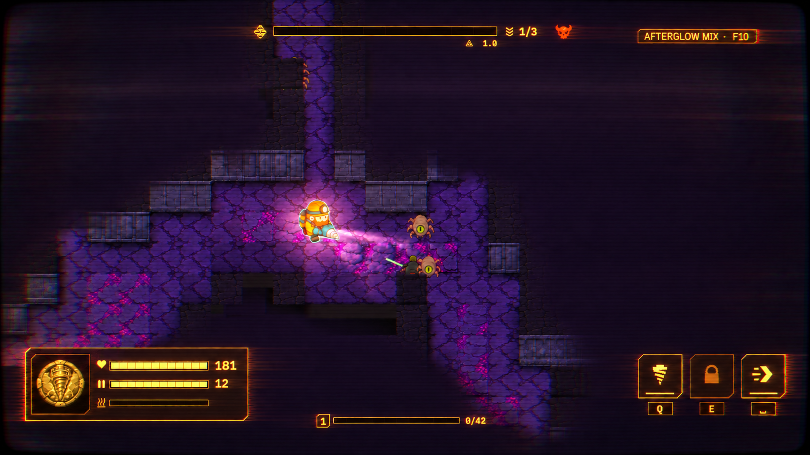
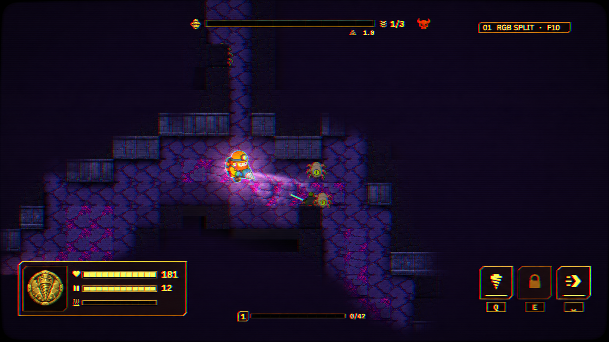
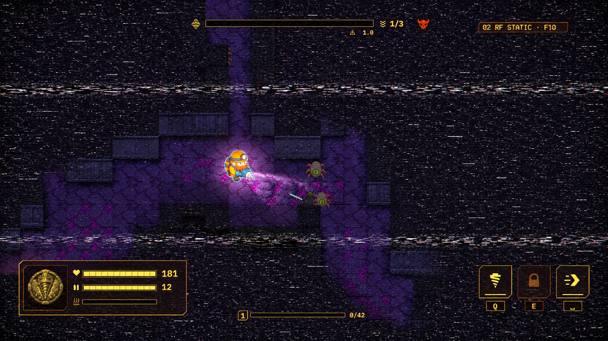
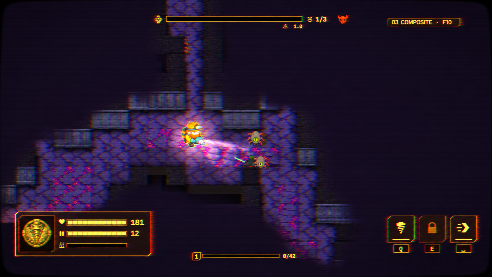
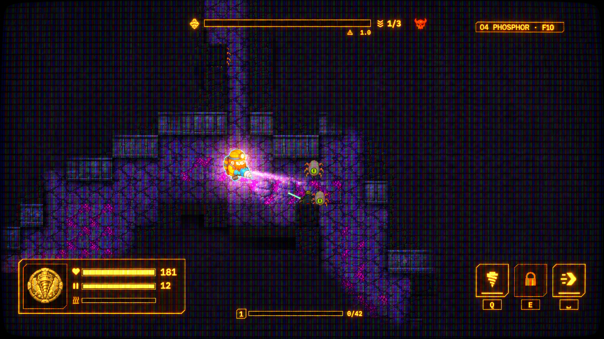
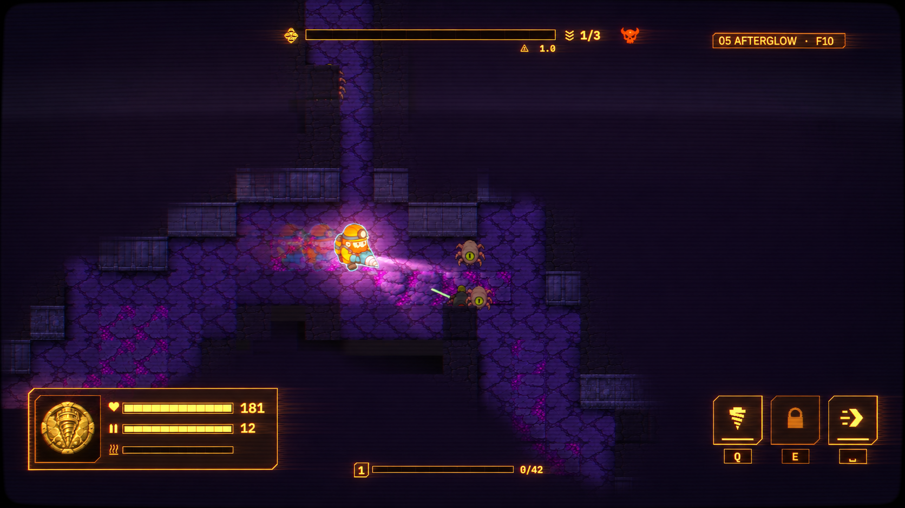

# CRT 셰이더 재설계: 시안 5종

## 사용자 선택 조합: AFTERGLOW MIX

5번 잔상을 기본으로 3번 수평 색 번짐을 소량 결합. 중앙 캐릭터와 주변 전투 영역은 비교적 선명하게, 외곽과 모서리로 갈수록 잔상·색 번짐이 점진적으로 증가한다. 이는 후속 AI 생성 시안이며 아직 Unity 반영은 하지 않았다. 중앙의 복제처럼 보이는 큰 잔상은 제거하고 주변부에 인광 흔적을 남겼다. 내장 image_gen으로 05를 편집 대상, 03을 보조 효과 레퍼런스로 사용했다. 아래 프롬프트의 20%는 미술적 지시이지 검증된 셰이더 수치가 아니다.



### 조합 시안 최종 프롬프트

```text
Use case: style-transfer. Create ONE refined 16:9 Tunnel Crew CRT game-screen concept.
Input 1 is the EDIT TARGET and PRIMARY STYLE, concept 05 AFTERGLOW.
Input 2 is a SECONDARY EFFECT REFERENCE ONLY, concept 03 COMPOSITE.
User direction: use 05 as the base, mix in only a little of 03, with effects increasing toward the screen edges and a comparatively clear center.
Keep exact camera, dungeon, character and monster positions, HUD layout, numbers, icons, original purple terrain, orange miner and amber UI from input 1. Preserve modest curved black glass border. Do not add objects, monitor housing, diagrams or inset comparisons.
Dominant look: warm luminous phosphor afterglow from 05, fine restrained interlaced scanlines, faint decaying horizontal light trails. Add ONLY about 20% of reference 03's horizontal chroma bleed/soft color separation as a secondary accent.
CRITICAL SPATIAL DISTRIBUTION: central oval covering approximately the middle 45% of width and 50% of height is crisp and relatively clean. The central miner MUST have a single clear silhouette: remove the obvious duplicate-figure ghosts in input 1 near the center. Central enemies and nearby tile edges sharp, minimal chroma bleed. Smooth continuous falloff—not a visible circular mask or ring—from this calm center toward stronger effects in the outer third of the frame, strongest at corners. Peripheral stone edges and lower-left/upper/right HUD edges show tasteful translucent amber afterglow tails plus subtle red/cyan horizontal color bleed. Edge HUD text remains readable and not doubled beyond recognition. Fine scanlines persist even at center but weaker. Upper/mid side walls, bottom panels and corner edges should clearly look more analog than central play area.
No global blur, no heavy RF snow, no strong RGB triple image, no coarse phosphor grid, no stronger vignette/black crush masquerading as this falloff. Preserve scene brightness. Deliberate refined game-ready visual direction, not extreme damaged-TV effect. Replace only top-right variant label with exact "AFTERGLOW MIX · F10". Single full-screen image only.
```


2026-09-12 · 사용자 선택 대기. 게임 코드와 현재 프리셋은 수정하지 않았다.

## 재설계 이유

기존 5종은 마스크·번짐·잔상을 다르게 구성했지만 실제 화면에서 구별이 약했다. 이번에는 곡률 대신 각 효과의 시각적 특징을 주인공으로 삼는다. 아래 이미지들은 내장 이미지 생성 도구로 만든 미술 시안이며, 실제 Unity 셰이더 출력이나 물리적 정확성·성능의 증거가 아니다. 움직임은 대표 순간으로 표현했다. 생성 편집 특성상 밝기·미세 형태가 원본과 완전히 일치하지는 않는다.

## 조사 근거

- [Libretro CRT-Royale](https://docs.libretro.com/shader/crt_royale/): aperture grille / slot / shadow mask, RGB 수렴 오차, 빔 분포, halation, 유리 확산, interlace를 별도 축으로 제어한다.
- [Libretro CRT 셰이더 목록](https://docs.libretro.com/shader/crt/): 곡률뿐 아니라 scanline, 인광 마스크, blur/blend와 glow가 외관을 구성한다.
- [TSUISHI CRTshader 원저자 설명](https://github.com/TSUISHI/CRTshader): YIQ 컴포지트 변복조, 색/휘도 대역폭 제한과 RF 열화에서 dot crawl, 색 번짐, snow, sync jitter, ghosting이 발생하도록 구성한다. 성능 주장은 이번 프로젝트에서 검증하지 않았으며 코드는 가져오지 않았다.

## 시안별 판단 포인트

| 번호 | 이름 | 주인공 효과 | 혼동하면 안 되는 차이 |
|---|---|---|---|
| 1 | RGB SPLIT | 선명한 빨강·청록 윤곽 어긋남 | 외곽 곡률만이 아니라 중앙 캐릭터와 HUD도 색 정렬 불량 |
| 2 | RF STATIC | 전역 흑백 잡음과 얇은 동기 불량 띠 | 영화 필름 그레인이 아니라 수신 잡음. 현재 시안은 의도적으로 강함 |
| 3 | COMPOSITE | 수평 색 번짐과 컬러 신호 지연 | 1번의 또렷한 채널 분리와 달리 흐릿하게 옆으로 새는 색 |
| 4 | PHOSPHOR | 거친 RGB 인광 셀과 국소적인 빛 번짐 | 균일 노이즈가 아닌 규칙적인 발광 격자. 마스크 피치는 미술적 과장 |
| 5 | AFTERGLOW | 교차 주사와 시간 잔상 | 캐릭터 복제가 아니라 이전 프레임의 감쇠 흔적. 정지 이미지로 시간 감각은 완전 검증 불가 |

공통 기준: 동일한 원본 장면, 황색 HUD, 보라색 지층과 주황색 캐릭터 유지. 월드 전체를 단색으로 바꾸지 않는다. 실제 구현 시 시간 잡음/잔상은 영상 비교가 필요하며 접근성 설정도 별도로 유지한다. 사용자가 선택하기 전에는 Unity 프리셋을 교체하지 않는다.

### 01 RGB SPLIT



### 02 RF STATIC



### 03 COMPOSITE



### 04 PHOSPHOR



### 05 AFTERGLOW



## 생성 방법과 최종 프롬프트

내장 image_gen, 시안별 개별 호출 5회. 공통 edit target: `img/runtime/run-00-off.jpg`. 각 최종 프롬프트는 아래 공통 프롬프트 + 해당 label 문장 + 해당 효과 프롬프트의 결합이다. CLI/API 우회 또는 수동 이미지 후처리는 사용하지 않았다.

### 공통 프롬프트

```text
Use case: style-transfer. Asset type: one full-screen 16:9 game CRT shader art-direction mockup, NOT a physical monitor photo. Input image 1 is the edit target: exact Tunnel Crew game screenshot. Preserve the dungeon composition, character positions, scale, all HUD layout, numbers and icons. Keep purple rocks, orange miner and amber UI identifiable; no global monochrome tint, no redesign, no added objects or interface. Apply the effect to WORLD AND HUD uniformly. Keep the SAME modest rounded screen geometry with just a thin black edge for every variant; curvature must NOT be the distinguishing feature. Do not zoom, crop, add inset panels, annotations, a monitor casing or any captions. Replace only the existing top-right "CRT OFF" label with the specified short variant name, preserving F10. This is an intentionally pronounced but readable shader target, not a subtle filter. The hallmark MUST be visible when the whole screenshot is fit to a normal screen. Preserve gameplay readability and original scene brightness.
```

### 01-rgb-misconvergence

```text
Top-right label: "01 RGB SPLIT · F10".
Dominant effect: pronounced electron-gun RGB MISCONVERGENCE. Show discrete red contours displaced left/up and cyan-blue contours right/down around the miner, every HUD numeral, slot edge and stone edge, roughly 4-7 output pixels at 1920-wide. Not a soft rainbow vignette: distinctly separated color registration outlines across the picture, especially the central orange helmet and amber bars. Original full-color shapes remain centered and solid. Fine stable scanlines only. Minimal noise, no snow, no horizontal tearing, no ghost trails, no broad bloom. Crisp electrically colorful out-of-registration vintage color tube.
```

### 02-rf-snow

```text
Top-right label: "02 RF STATIC · F10".
Dominant effect: BAD RF RECEPTION / electrical static. Dense fine black-white salt-and-pepper snow over the ENTIRE picture visibly filling dark areas, with uneven clumps and short horizontal interference dashes. Two narrow ragged noisy horizontal sync bands cross the scene at different heights, shifting those thin strips sideways 8-12 pixels, all while over 85% of picture remains clearly readable. Mild RF ghost only, minimal RGB split, no colorful rainbow screen wash, no coarse phosphor grid, no large bloom. A captured instant of recognizably crackling weak antenna reception, NOT cinematic film grain or scratches. Visible texture even in empty darkness, but do not blanket image in opaque white.
```

### 03-composite-chroma

```text
Top-right label: "03 COMPOSITE · F10".
Dominant effect: NTSC COMPOSITE COLOR BLEED / dot crawl. Keep luminance shapes and HUD numbers readable, while color resolution is much lower horizontally: orange, purple and yellow chroma smears 10-18 pixels sideways beyond sharp luminance edges, soft delayed colored fringes, zipper/checkerboard dot-crawl at high-contrast colored edges, small rainbow cross-color moire on fine stone details. This is an old consumer television composite cable picture: horizontal chroma dragging, not uniformly offset crisp RGB outlines, not RF snow, not VHS tracking damage. Low-medium soft scanlines, very little noise. Distinctly smeary watercolor-like COLOR SIGNAL but stable clean underlying image geometry and recognizable colors.
```

### 04-phosphor-arcade

```text
Top-right label: "04 PHOSPHOR · F10".
Dominant effect: COARSE RGB PHOSPHOR SLOT MASK and saturated beam bloom. Cover the complete world and HUD in clearly visible regular tiny vertical red-green-blue luminous phosphor triads separated by dark slots, enough pitch to resolve at whole-image view, around 5-6 output pixels per triad at 1920-wide. Dark horizontal scanline gaps intersect this glowing mesh; bright parts swell and bridge gaps, dark parts retain the grid. Amber HUD and orange helmet have intense local soft halation and luminous hot centers, making a rich glowing arcade CRT. Stable electrically clean signal: absolutely no snow, tearing, delayed duplicate silhouettes or chromatic misregistration. Avoid simply darkening image; preserve average scene luminance with radiant bright phosphors. Distinct from plain scanline overlay: visibly made of colored emitting cells.
```

### 05-persistence-interlace

```text
Top-right label: "05 AFTERGLOW · F10".
Dominant effect: LONG PHOSPHOR PERSISTENCE AND INTERLACED FIELDS, captured during a tiny camera movement. Keep the exact original current frame and positions, with only luminous residual traces of previous frames: two faint progressively fading colored edge echoes displaced 8 and 18 pixels left from the central miner, bright stone edges and HUD outlines. These are translucent decaying light contours, NOT additional solid characters. Horizontal odd/even scanline comb edges slightly offset on bright moving silhouettes; a broad dim scan/decay band across the upper half expresses the rolling refresh. Bright amber UI strokes leave soft amber light tails, original orange/teal subject colors remain. Deep velvety tube blacks with readable terrain, subtle halation. No RF snow, no RGB-separated triple contours, no coarse grid, no opaque scan band. Haunting luminous memory/afterimage is the primary immediately visible feature.
```

