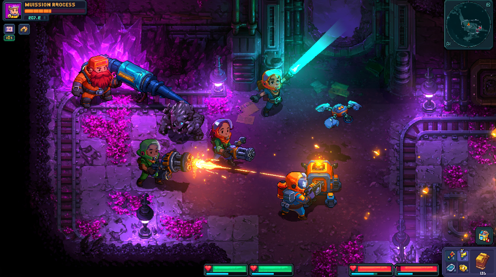

# TunnelCrew 인게임 배경 업그레이드 리서치

> 2026-09-15 후속 결정: [연결형 환경 리소스·캐릭터 그림자 계획](connected-environment-visual-upgrade-plan.md)을 우선한다. 큰 세트피스의 독립 배치보다 광물·레일의 타일 연결과 채굴 후 일관성을 먼저 검증한다. 아치 제작은 보류한다. 아래 내용은 기존 조사 기록이다.

## 결론

TunnelCrew의 벽이 평범하게 보이는 가장 큰 이유는 텍스처 해상도나 노멀맵의 부족이 아니다. 현재 벽은 기본적으로 **고체 셀 하나당 직사각형 cap 한 장과 남향 정면 한 장**을 놓고, 모든 cap을 같은 높이로 올린다. 조명과 표면 디테일은 이미 상당히 갖춰졌지만, 멀리서 먼저 읽히는 외곽선은 여전히 1셀 계단과 직각 덩어리다. 셰이더는 내부 명암을 풍부하게 만들 수 있어도 알파 실루엣 자체가 네모라면 이 문제를 해결하지 못한다.

가장 적합한 방향은 전체를 3D로 갈아엎는 것이 아니라 다음의 **2D 기반 2.5D 하이브리드**다.

1. 시뮬레이션·충돌 격자는 그대로 둔다.
2. 벽의 렌더 전용 외곽선을 청크 단위 contour로 다시 만든다.
3. 그 외곽선에 불규칙한 어깨, 오버행, 파임, 잔석을 붙여 1셀 계단을 숨긴다.
4. 2×1, 3×2 같은 멀티셀 구조물과 세트피스가 방의 큰 리듬을 만든다.
5. 기존 `WorldLit`에 월드 공간 de-tiling과 재질별 미세 반응을 보강한다.
6. 광원·안개·전경은 디테일을 고르게 밝히는 용도가 아니라 길 찾기와 초점 형성에 쓴다.
7. 선택된 영웅 구조물만 저폴리 3D 또는 3D 프록시로 시험한다.

이 조합은 현재의 `SurfaceTopologyBuilder`, `WallContourTracer`, 청크 dirty 갱신, `EnvironmentKit`, 2D 광원·그림자·노멀맵 자산을 대부분 재사용한다. 반면 전면 3D 전환은 Renderer2D, 정렬, 파괴 갱신, 기존 2D 아트의 투영 계약을 동시에 흔들기 때문에 지금 단계의 첫 선택으로는 비용 대비 위험이 크다.

현재 화면은 표면 질감과 국소 조명이 존재하지만, 벽 덩어리의 외곽선·높이·폭이 셀 단위로 반복된다. 중앙 플레이 공간보다 동일한 직사각 벽 조각이 더 강한 패턴으로 읽히는 구간도 있다.

목표 레퍼런스는 정사각 타일을 완전히 없애지 않는다. 대신 큰 결정군, 철골, 레일, 파이프, 잔석, 발광 식생, 개구부가 타일 경계를 여러 크기로 가로질러 덮고, 벽의 실루엣도 직선이 아니라 돌출·파임·전경 가림으로 끊는다.

## 현재 구현의 강점과 병목

### 이미 갖춘 기반

- Unity 6000.3.15f1, URP 17.3.0, Renderer2D를 사용한다.
- `WorldLit.shader` 계열은 Albedo, Normal, AO, Material Mask, Emission, MinLight 채널을 처리한다.
- `EnvironmentChunkRenderer`는 바닥, 바닥 디테일, 접촉 AO, 벽 정면, 벽 상단, 모서리, 전경 cap을 별도 Tilemap으로 분리한다.
- `SurfaceTopologyBuilder`는 8이웃을 읽어 바닥 경계, 벽 상단, 정면, 측면, 안·바깥 모서리, 전경 cap을 결정하고, 변형은 셀별 난수 대신 매크로 블록 해시로 고른다.
- `WallContourTracer`와 `ShadowGeometryBuilder`는 벽 외곽 고리를 추적해 실제 벽 형태와 일치하는 ShadowCaster2D를 만든다.
- `EnvironmentKit`과 지층별 키트, `SetPieceCatalog`·`SetPieceSpawner`, 접촉 AO, 균열, 광맥 정면, 횃불 소켓, 대기 분리, 전경 페이드가 이미 존재한다.
- 프로젝트에는 `com.unity.2d.spriteshape` 13.0.0과 Tilemap Extras 6.0.1이 이미 설치되어 있다.

즉, 기반 기술이 없는 상태가 아니다. 오히려 **벽 외곽 고리를 이미 계산하면서, 화면에는 다시 셀 사각형으로 그리는 간극**이 핵심 기회다.

### 네모로 읽히는 직접 원인

1. **실루엣 주파수가 하나다.** 모든 돌출과 파임이 1셀 폭, 1셀 높이의 계단으로 나타난다.
2. **벽 높이가 전역 하나다.** seam 방지를 위해 필요한 결정이지만, 연결된 벽 전체가 같은 높이의 띠로 읽힌다.
3. **cap과 front가 셀 단위다.** 매크로 해시는 그림 종류를 묶을 뿐, geometry footprint를 바꾸지 않는다.
4. **측면은 현재 의도적으로 렌더하지 않는다.** ReferenceTopDown 계약에서는 합리적이지만, 결과적으로 벽의 입체감을 만드는 정보가 cap/남향 front/그림자에 몰린다.
5. **기준 키트의 실제 변형 폭이 작다.** `EnvironmentKit_ReferenceV1.asset`은 floor, wallTop, wallTopRim, wallFront가 각 3종이고, west/east side와 inner/outer corner 배열은 비어 있다.
6. **노멀맵은 표면 안쪽만 바꾼다.** 현재 캡처처럼 광원 반응이 좋아져도 타일의 바깥 윤곽은 그대로다.
7. **방의 문법보다 재질 변형이 앞에 보인다.** 방마다 “광산 갱도”, “결정 동굴”, “붕괴 구간”, “기계실” 같은 큰 구조적 문장이 충분히 반복되지 않는다.

## 기술 선택지

### 1. 멀티셀 모듈과 실루엣 오버레이

가장 빠르고 안전한 개선이다. 기존 1×1 타일은 이음새와 파괴 상태를 보장하는 베이스로 남기고, 그 위에 2×1·3×1·2×2 장식 모듈을 결정적으로 덮는다.

필요한 모듈 예시는 다음과 같다.

- 2~3셀을 가로지르는 암반 어깨와 돌출 선반
- 오목한 균열, 무너진 벽, 반원형 굴 입구
- 벽과 바닥 사이의 잔석 띠와 큰 낙석
- 벽 위를 가로지르는 보강 철골, 케이블, 파이프
- 지층별 결정군, 뿌리, 점액, 기계 잔해
- 방 모서리를 차지하는 L자 구조물
- 통로 폭을 시각적으로 좁히는 전경 오버행

배치는 현재의 매크로 해시와 청크 dirty 경로를 재사용할 수 있다. 중요한 규칙은 “셀마다 하나씩”이 아니라 **방 또는 contour segment마다 밀도 예산을 두는 것**이다. 동일한 장식이 매 셀에 붙으면 새 패턴이 또 다른 타일 격자가 된다.

장점은 파괴·정렬·조명을 거의 그대로 유지한다는 점이다. 단점은 베이스 외곽선 자체는 여전히 계단이므로, 이것만으로는 근본적인 silhouette 개선에 한계가 있다.

### 2. contour 기반 유기적 벽 렌더링

추천하는 핵심 투자다. 게임플레이 고체 셀에서 이미 얻는 외곽 고리를 렌더 전용 경계로 사용한다. 각 직선 segment에 seed 기반의 작은 안팎 오프셋을 주고, 코너는 안전 반경 안에서 bevel 또는 둥근 연결로 바꾼다. 충돌과 채굴 판정은 기존 셀 그대로이므로 손맛은 변하지 않는다.

두 구현 경로가 있다.

#### SpriteShape 경로

Unity의 SpriteShape는 spline 외곽을 따라 edge sprite를 변형·교체하고 내부를 반복 텍스처로 채우는 용도다.[^1] 현재 프로젝트에 13.0.0이 설치되어 있어 기술 스파이크가 빠르다.

- contour loop 하나를 closed SpriteShape로 만든다.
- 각 지층의 rim profile, fill texture, corner sprite를 연결한다.
- 파괴 시 기존 dirty chunk와 맞물려 해당 형상만 다시 생성한다.
- 그림자 contour는 원본 gameplay contour를 쓰고, 시각 contour와 최대 편차를 제한한다.

다만 SpriteShape는 본래 수작업 spline 월드에 강하다. 많은 동적 고리를 자주 재생성하는 파괴 게임에서는 GC, geometry bake, atlas 제약을 반드시 측정해야 한다. 아틀라스에서 rotation과 tight packing을 끄라는 공식 제약도 있다.[^1]

#### 전용 청크 메시 경로

`WallContourTracer`의 고리를 직접 triangulate해 cap mesh와 front skirt mesh를 만든다. UV는 월드 공간을 사용하고, 알베도·노멀·AO·마스크 아틀라스를 기존 재질 계약에 맞춘다.

- cap: contour를 안쪽으로 채운 2D mesh
- rim: 외곽선 ribbon mesh
- front: 남향 또는 화면 하단을 향한 segment에서 아래로 내린 skirt
- rubble: 경계 segment를 따라 instanced decal/quad 배치
- occluder: 화면 하단 contour만 전경 그룹으로 분리

이 방식은 제어력과 성능 예측성이 높다. 여러 조각을 한 청크 mesh로 합치면 draw call을 줄일 수 있으며 Unity도 `Mesh.CombineMeshes`를 성능 최적화 수단으로 문서화한다.[^2] 대신 코너 UV, 오목 고리 triangulation, 전경 페이드 경계를 직접 책임져야 한다.

### 3. 셰이더 업그레이드

셰이더는 silhouette 개선과 함께 사용할 때 효과가 크다. 단독 1순위는 아니다.

#### 월드 공간 de-tiling

현재 한 셀 안의 패턴이 여러 셀에서 같은 위치에 반복되면 격자가 강화된다. 월드 좌표로 큰 주기의 detail normal·albedo tint를 얹고, seed별 회전/미러가 안전한 비방향성 채널만 섞는다. 작은 바위·균열·얼룩을 불규칙 위치에 뿌리는 texture bombing은 반복을 줄이는 고전적 방법이지만, NVIDIA 예제도 여러 texture sample과 수십 개의 연산이 든다고 명시한다.[^3] TunnelCrew에서는 전면 8-sample 구현보다 다음의 제한형이 적합하다.

- 1회 base sample
- 1회 저주파 macro tint/noise
- 1~2회 sparse detail decal
- 화면에서 2픽셀 이하인 디테일은 생략

#### 경계 거리 채널

벽 내부에 “외곽선까지의 거리” 또는 edge mask를 제공하면 rim wear, 습기, 결정 성장, 먼지 퇴적을 경계에서만 만들 수 있다. 런타임 jump-flood SDF보다, 청크 갱신 때 CPU로 작은 distance field를 만들거나 tile channel에 미리 굽는 편이 이 규모에서는 단순하다.

#### 높이 착시

- cap 중앙은 차갑고 어둡게, 화면 하단 rim은 밝고 얇게 유지한다.
- front에는 위→아래 비선형 명암과 방향성 streak를 준다.
- contact AO는 강한 검은 선이 아니라 넓고 낮은 주파수로 둔다.
- wet/crystal mask에만 국소 specular와 emission pulse를 허용한다.
- parallax occlusion mapping은 영웅 바위·결정 같은 제한 자산에만 시험한다. 직교 카메라와 작은 픽셀 스프라이트에서는 비용에 비해 silhouette이 변하지 않고 shimmer가 생길 가능성이 높다.

노멀맵은 작은 홈과 돌 표면을 살리는 데 맞다. Unity도 노멀맵을 실제 geometry를 늘리지 않고 홈·스크래치가 빛에 반응하도록 하는 기술로 설명한다.[^4] 큰 돌출이나 벽의 외곽선은 geometry/alpha로 해결해야 한다.

### 4. 레이어드 2.5D

2.5D는 하나의 기술이 아니라 여러 단계의 선택지다.

| 방식 | 화면 | 실제 구조 | 적합도 |
|---|---|---|---|
| 다층 스프라이트 카드 | 2D | 바닥·중경·전경을 Z/Sorting Layer로 분리 | 매우 높음 |
| 2D cap + 얇은 3D rim/mesh | 2D처럼 보임 | 벽 외곽만 MeshRenderer | 높음, 스파이크 필요 |
| 3D 프록시 + 2D 캔버스 | 최종은 2D | 별도 3D geometry가 조명·가시성 계산 | 중간, 고비용 |
| 3D 모델을 2D sprite로 bake | 2D | 제작 과정만 3D | 세트피스·애니메이션에 높음 |
| 전체 3D 환경 + 2D 캐릭터 | 3D | 월드 전부 mesh/light/probe | 낮음, 장기 선택 |

#### 다층 스프라이트 카드

현재 시스템과 가장 잘 맞는다. 벽을 cap/front 두 장만으로 보지 않고 뒤쪽 암반, 실제 벽, foreground overhang, 먼 배경 void의 네 거리로 나눈다. 카메라 이동에 0.5~2% 정도의 제한된 parallax를 주면 화면이 2D인 채로 깊이가 생긴다. 플레이 영역과 collision을 움직이지 않으므로 안전하다.

#### 3D 프록시 + 2D 캔버스

`The Stone of Madness`는 3D gameplay/proxy scene와 2D sprite canvas를 분리한다. 프록시에 고유 Render ID를 주고, 여러 render texture를 통해 3D 조명·가시성 정보를 같은 ID의 2D sprite에 합성한다.[^5] 이 방식은 회화적 2D를 유지하면서 3D 조명과 가시성 계산을 얻는 고급 해법이다.

TunnelCrew에서는 전면 도입보다 20×14 테스트 룸 하나로 제한해야 한다. 이미 URP 2D 조명과 contour shadow가 있으므로, 새 프록시가 주는 이득이 “그림자 정확도”뿐이라면 투자 가치가 낮다. 대신 높이가 큰 드릴, 아치, 수정 기둥이 벽에 드리우는 그림자와 전경 occlusion을 자연스럽게 만드는지 검증해야 한다.

#### 3D→2D bake

Dead Cells는 기본 모델 시트를 바탕으로 3D 모델·리그를 만들고, 저해상도 cel-shading과 anti-aliasing 없는 렌더를 거쳐 pixel sprite로 만든 제작 파이프라인을 공개했다.[^6] 이 발상은 TunnelCrew의 벽 전체보다 회전·파괴 상태가 많은 기계, 드릴, 엘리베이터, 문, 큰 수정 구조물에 유용하다. 런타임은 여전히 2D이고, 제작 시점에 일관된 원근·노멀·그림자를 얻는다.

### 5. 선택적·전면 3D

#### 선택적 3D 영웅 구조물

아치, 대형 드릴, 파이프 매니폴드, 승강기, 보스 문처럼 방의 정체성을 만드는 물체만 orthographic 3D로 둔다. 저폴리 형태, 제한된 재질, 픽셀 밀도와 맞춘 nearest/dither 후처리로 2D 캐릭터와 섞는다.

장점은 한두 개 오브젝트만으로 큰 형태와 parallax, 정확한 그림자를 얻는다는 점이다. 단점은 현재 Renderer2D와 3D Lit 조명 체계를 한 카메라에서 자연스럽게 결합하는 검증이 필요하다는 점이다. 2D Light는 호환 2D 오브젝트를 대상으로 하고, sorting layer를 나눌수록 추가 light/shadow texture로 성능이 떨어질 수 있다고 Unity가 경고한다.[^7]

#### 전면 3D 환경

그리드로부터 높이 있는 mesh를 만들고 bevel, vertex noise, tri-planar material, decals, baked AO, light probes를 쓰는 방식이다. `The Ascent`는 environment Blueprint 라이브러리, baked+dynamic lighting, volumetric lighting, reflection probe를 결합해 작은 팀이 고밀도 top-down 세계를 만들었다.[^8]

이것이 시각적 상한은 높지만 TunnelCrew에는 다음 재작업이 따른다.

- ReferenceTopDown용 2D 자산과 투영 계약 재설계
- Renderer2D와 3D renderer 선택 또는 camera compositing
- 2D Light/ShadowCaster2D를 3D light/shadow로 교체
- SpriteRenderer footpoint sorting과 mesh depth 교차 문제 해결
- 실시간 파괴 mesh, collider, nav/LOS 표현 동기화
- 모든 지층 아트의 3D 재제작

따라서 “완성 방향”으로 바로 선택하기보다, 선택적 3D 세트피스가 충분한 향상을 주지 못했을 때만 재평가한다.

## Steam 게임 사례

아래는 공개적으로 확인된 제작 설명과 Steam 상의 실제 화면에서 관찰한 시각 구조를 분리한 것이다. 내부 구현이 공개되지 않은 부분은 “관찰/추론”으로 표시한다.

### Deep Rock Galactic — 구조, 표면 노이즈, debris를 분리

Ghost Ship Games의 공식 설명에 따르면 cave는 “구슬을 꿴 것처럼” 수작업 room template을 연결한다. 각 template은 구·반구·평면으로 carve volume을 정하고, mirror/warp/overlap되며, 그 위에 biome별 noise와 debris가 적용된다. 같은 공간도 biome에 따라 표면 형태, fog, lighting, flora/fauna가 달라진다.[^9]

TunnelCrew에 옮길 핵심은 3D voxel이 아니다.

- 방의 큰 형태를 만드는 template 문법
- 셀 외곽을 흐트러뜨리는 표면 noise
- 지층마다 다른 debris·안개·광원 규칙
- 같은 layout도 다른 silhouette과 landmark를 갖게 하는 키트

현재 `EnvironmentKit`은 재질과 타일 변형에는 강하지만, 방 단위 “구조 문법”이 약하다. 지층별로 3~5개의 room dressing archetype을 추가하는 것이 대응책이다.

### Core Keeper — 격자를 숨기지 않고 빛과 biome으로 의미화

Core Keeper는 공식 Steam 설명에서 Clay Caves의 살아 있는 벽, Shimmering Frontier의 수정 동굴처럼 biome를 각기 다른 생태와 구조로 구분한다.[^10] 개발자 인터뷰에서도 시각적 독창성의 핵심으로 lighting을 직접 꼽았다.[^11]

화면 관찰상 벽의 기본 tile grid는 남아 있지만 다음이 격자를 약화한다.

- 플레이어 주변의 제한된 가시성과 강한 국소 광원
- biome마다 크게 다른 재질·식생·발광체
- 벽 가장자리와 내부의 서로 다른 명도 그룹
- 채굴·건축 오브젝트가 경계를 계속 재구성

TunnelCrew는 이미 이 접근을 상당 부분 구현했다. 따라서 Core Keeper를 따라 광원 수를 늘리는 것보다, **현재 조명 기반 위에 실루엣과 biome grammar를 추가하는 것**이 맞다.

### Dome Keeper — 제한된 팔레트와 큰 덩어리

개발 인터뷰에 따르면 Dome Keeper는 8색 팔레트와 320×270 해상도라는 강한 제약에서 배경 세계를 구성했다.[^12] Steam 화면에서는 광물 군집, 빈 동굴, 균열, 색상 밴드가 작은 타일보다 큰 덩어리로 읽힌다.[^13]

교훈은 디테일을 많이 넣는 것이 아니라, 화면 해상도에서 먼저 읽히는 3단계 값을 만드는 것이다.

- 방/광맥의 대형 silhouette
- 3~6셀 규모의 material cluster
- 1셀 안의 미세 texture

TunnelCrew의 변형 선택도 이 순서로 평가해야 한다. 1셀 디테일이 늘어도 3~6셀 덩어리가 없으면 “노이즈 많은 격자”가 된다.

### Rain World — 타일을 최종 그림이 아니라 렌더 입력으로 사용

초기 개발 로그는 loose object와 tile set을 조합해 더 큰 일관된 구조를 렌더하고, 개발자가 목표를 “pixel art world”가 아니라 “세계를 pixel art로 렌더한 것”이라고 설명한다.[^14] 최신 Unity 인터뷰도 환경과 생물을 절차 시스템으로 확장하는 접근을 다룬다.[^15]

TunnelCrew에 가장 직접적인 참고점이다. 시뮬레이션 타일은 collision과 파괴의 진실로 남기되, 최종 화면은 다음의 합성 결과가 되어야 한다.

`solid field → contour/room classification → large structure → surface pass → props/debris → atmosphere`

지금은 첫 단계에서 바로 tile sprite로 내려가는 구간이 강하다. 중간에 large structure와 surface pass를 넣는 것이 핵심이다.

### Hades — 대형 회화 자산과 레이어 구성

Supergiant 개발자의 Steam 답변에 따르면 Hades의 environment art 대부분은 hand-painted 2D이고, 일부 3D animated effect도 엔진에서는 2D animation으로 처리된다.[^16] 즉, 고급스러운 isometric 화면이 반드시 실시간 3D 환경을 요구하는 것은 아니다.

Hades식 교훈은 타일보다 큰 composition이다.

- 방당 1~3개의 큰 silhouette anchor
- 바닥을 가로지르는 비정형 decal과 균열
- 앞·중간·뒤 레이어의 명확한 겹침
- 테두리 장식이 gameplay floor를 액자처럼 둘러싼 구성

절차 맵 전체를 Hades처럼 손으로 칠할 수는 없지만, 수작업 room chunk와 procedural 연결을 섞으면 핵심 효과를 얻을 수 있다.

### Children of Morta — 2D를 유지한 커스텀 조명

개발팀의 postmortem은 표준 2D pixel art pipeline에 독자적인 lighting을 통합하기 위해 customized rendering pipeline을 만들었다고 설명한다. 또한 level과 object가 절차 생성되기 때문에 asset lifecycle을 위한 내부 도구가 중요했다고 적는다.[^17]

이는 TunnelCrew가 이미 선택한 방향을 지지한다. 2D를 버리는 것보다 `WorldLit`, channel atlas, 지층 프로파일, 자동 캡처를 더 생산 친화적으로 만드는 편이 일관된다. 다만 Morta의 사례도 조명만으로 방 구조를 대체하지는 않는다.

### The Stone of Madness — 3D 계산, 2D 최종 화면

앞서 설명한 proxy scenario와 canvas scenario의 분리는 2.5D의 고급형이다.[^5] 3D 깊이·조명·가시성은 proxy에서 계산하고, 최종 sprite는 Render ID를 통해 그 결과를 받는다.

TunnelCrew에 필요한 경우는 제한적이다.

- 높이가 큰 구조물의 정확한 투영 그림자
- 캐릭터와 복잡한 아치/기계 사이의 occlusion
- 손전등이 3D 높이에 따라 벽·바닥을 다르게 비추는 효과

이 세 가지가 현재 2D contour 방식으로 충분히 해결되면 도입하지 않는 편이 낫다.

### The Ascent — 전면 3D의 품질 상한과 제작비

공개 인터뷰에서 The Ascent 팀은 environment Blueprint 라이브러리, baked/dynamic light 혼합, volumetric light, reflection probe, Houdini 기반 제작 자동화를 설명한다.[^8] 화면 밀도는 높지만 그것을 가능하게 한 것은 단순히 3D 엔진이 아니라 **반복 제작을 자동화한 도구 체계**다.

TunnelCrew가 전면 3D를 택한다면 먼저 mesh 한두 개가 아니라 다음이 필요하다.

- grid→mesh 생성기
- biome material rule
- decal/prop scatter
- destruction rebuild
- lighting preset과 probe bake 정책
- 자동 성능·시각 회귀 캡처

이 도구 비용을 감당하지 않으면 3D 전환 후에도 “네모난 박스에 좋은 조명”만 남을 수 있다.

### Dead Cells — 3D를 런타임이 아닌 생산 도구로 사용

Dead Cells의 3D→pixel sprite pipeline은 애니메이션 생산성 문제를 해결하기 위해 선택되었다.[^6] TunnelCrew에서는 반복 상태가 많은 기계 세트피스와 구조물 변형을 DCC에서 자동 렌더하는 용도로 응용할 수 있다. 배경 전체 실시간 3D보다 위험이 작고, 기존 2D renderer와도 잘 맞는다.

## 권장 목표 스택

### A. 게임플레이 격자

변경하지 않는다. 파괴, LOS, 이동, AI, 저장은 현재 `WorldGrid`와 solid field를 계속 사용한다.

### B. 렌더용 형태 계층

1. `Gameplay Solid`: 원본 셀
2. `Visual Contour`: 외곽 고리 + 제한된 불규칙 offset
3. `Wall Body`: cap fill + 남향 front skirt
4. `Edge Dressing`: rim, rubble, cracks, roots, crystals
5. `Room Grammar`: rail, pipe, support, gate, hero prop
6. `Depth Dressing`: far void, mid dust, foreground overhang

이 계층은 파괴 후에도 1→2→3만 즉시 재생성하고, 4~6은 anchor가 유효한 것만 갱신하도록 나눈다.

### C. 아트 키트 계약

지층 하나당 최소 권장 묶음은 다음과 같다.

| 자산군 | 최소 수량 | 목적 |
|---|---:|---|
| contour edge/rim | 방향·각도군 8~12 | 직선 반복 제거 |
| corner | 안/밖 × 4방향 × 2변형 | 현재 비어 있는 방향성 보완 |
| front segment | 1×1 3종 + 2×1 3종 + 3×1 2종 | 세로 벽 띠의 반복 제거 |
| overhang/shoulder | 6~10 | 실루엣 파임·돌출 |
| rubble/debris | 12~20 | 벽-바닥 접합 분해 |
| macro decal | 4~6 | 3~6셀 재질 덩어리 |
| room anchor | archetype당 2~3 | 방 정체성 |
| foreground | 4~6 | 깊이와 프레이밍 |

모든 방향을 회전 복제하지 않는다. 현재 코드 주석도 한 장의 corner를 네 방향에 쓰면 광원 방향과 어긋난다고 지적한다. albedo뿐 아니라 normal/AO/mask의 방향도 함께 맞아야 한다.

### D. 방 문법

지층별로 다음과 같은 room archetype을 둔다.

- 광산 갱도: 평행 보강재, 레일, 케이블, 작업등
- 자연 동굴: 큰 암반 어깨, 붕괴 잔석, 수분, 뿌리
- 수정 공동: 3~5셀 결정 anchor, 작은 결정 성장 규칙, magenta/cyan emission
- 폐기 기계실: pipe network, ventilation, oil/wet mask, amber warning light
- 심연: 큰 빈 공간, 전경 실루엣, 낮은 안개, 제한된 발광체

각 방은 archetype 하나를 주로 택하고, 다른 archetype 장식을 20% 이하로 섞는다. 모든 장식을 같은 확률로 섞으면 biome kit가 있어도 방의 문장이 사라진다.

## 권장 개발 순서

### 1단계 — 1주: silhouette A/B 스파이크

한 개의 고정 seed 방에서 세 버전을 만든다.

- A: 현재 타일 렌더
- B: 현재 타일 + 멀티셀 shoulder/rubble overlay
- C: contour 기반 SpriteShape 또는 전용 mesh + 같은 overlay

검증 항목:

- 25%, 50%, 100% 확대에서 벽이 셀 블록보다 동굴 덩어리로 먼저 읽히는가
- 캐릭터·적·채굴 대상의 판독성이 떨어지지 않는가
- 벽 한 칸 파괴 후 2~3프레임 안에 seam 없이 갱신되는가
- foreground fade와 silhouette가 기존대로 동작하는가
- 같은 seed가 항상 같은 결과를 내는가
- CPU rebuild, GC allocation, batches가 현재 대비 허용 범위인가

결정 기준은 “C가 B보다 명확히 낫고 비용을 감당할 수 있는가”다. 차이가 작으면 전용 contour renderer를 보류하고 멀티셀 자산에 투자한다.

### 2단계 — 1~2주: 가장 싼 고효율 개선

- 방향별 inner/outer corner 자산 연결
- 2×1·3×1 front/rim과 rubble overlay
- 방당 prop/decal 밀도 예산
- 월드 공간 macro tint/detail normal
- 지층별 room archetype 2종씩
- 기존 Visual Lab 캡처에 silhouette·repetition 검증 컷 추가

### 3단계 — 2~3주: contour renderer 프로덕션화

- `WallContourTracer` 결과를 visual contour 입력으로 재사용
- 청크별 mesh/SpriteShape rebuild
- 오목 고리와 map border 테스트
- 파괴 dirty 전파와 캐시
- 기존 `ShadowGeometryBuilder`와 시각 contour 간 허용 편차 규칙
- foreground segment 분리와 페이드
- atlas, material channel, sorting layer 계약 갱신

### 4단계 — 1~2주: 선택적 3D 세트피스 실험

- 아치 또는 대형 드릴 하나를 저폴리 3D로 제작
- orthographic camera에서 pixel density와 outline을 2D 자산에 맞춤
- 2D 캐릭터 앞뒤 정렬, 2D/3D light 일치, 그림자, CRT 후처리 확인
- 2D bake 버전과 실시간 3D 버전을 같은 구도로 비교

실시간 3D가 parallax와 조명에서 명확한 우위를 주지 않으면 bake sprite를 채택한다.

### 5단계 — 이후: 3D 프록시 또는 전면 3D 재평가

다음 조건이 모두 참일 때만 검토한다.

- 2D contour와 세트피스로도 원하는 높이·그림자를 못 얻는다.
- 3D 아티스트와 자동화 파이프라인을 확보했다.
- Renderer 전환과 기존 채널 재질 재작성 비용을 수용한다.
- 파괴 성능 스파이크가 목표 하드웨어에서 통과했다.

## 우선순위 평가

5점이 높다. 비용·위험은 점수가 낮을수록 유리하다.

| 후보 | 시각 효과 | 현재 구조 적합 | 제작 속도 | 런타임 안전 | 비용/위험 | 판정 |
|---|---:|---:|---:|---:|---:|---|
| 방향별 corner + 멀티셀 overlay | 4 | 5 | 5 | 5 | 2 | 즉시 |
| contour SpriteShape/mesh | 5 | 5 | 3 | 3 | 3 | 핵심 스파이크 |
| 월드 공간 de-tiling shader | 3 | 5 | 4 | 4 | 2 | 병행 |
| room archetype + setpiece grammar | 5 | 5 | 3 | 5 | 3 | 핵심 콘텐츠 |
| foreground/parallax card | 4 | 5 | 4 | 4 | 2 | 추천 |
| 3D→2D bake 세트피스 | 4 | 5 | 3 | 5 | 3 | 선택적 추천 |
| 실시간 3D 세트피스 | 4 | 3 | 2 | 3 | 4 | 제한 실험 |
| 3D proxy lighting | 4 | 2 | 1 | 2 | 5 | 후순위 |
| 전면 3D 환경 | 5 | 1 | 1 | 2 | 5 | 현시점 비추천 |

## 피해야 할 접근

- **타일 변형만 3종에서 12종으로 늘리기:** 사각 silhouette은 그대로이고 검수 비용만 커진다.
- **모든 셀에 랜덤 회전·스케일:** 방향성 normal, 광원, front pivot, seam을 깨뜨린다.
- **노멀맵 강도만 올리기:** 현재 캡처처럼 표면은 입체적이어도 격자는 더 또렷해질 수 있다.
- **셀마다 wall height 바꾸기:** 기존 설계가 지적한 대로 cap seam과 foreground 판정이 깨진다. 높이 변화는 연결 덩어리/세트피스/렌더 skirt 수준에서 처리한다.
- **작은 장식 균등 살포:** 시각 노이즈가 전투와 채굴 표식을 덮는다.
- **전면 POM·raymarch:** 작은 픽셀 화면에서 shimmer와 texture sample 비용에 비해 silhouette 이득이 없다.
- **3D로 바꾸면 자동으로 해결된다고 가정:** 방 문법·material rule·debris tool이 없으면 박스 mesh만 늘어난다.
- **어둠으로 문제를 숨기기:** Core Keeper식 darkness는 초점 도구이지 부족한 silhouette의 대체재가 아니다.

## 최종 제안

한 문장으로 정리하면, **“네모난 타일을 더 잘 칠하는 작업”에서 “격자를 입력으로 받아 동굴 외곽과 방 구조를 다시 그리는 작업”으로 전환**해야 한다.

가장 현실적인 첫 묶음은 다음 다섯 가지다.

1. `WallContourTracer`를 재사용한 render-only organic contour 스파이크
2. 2×1·3×1 벽 어깨/정면과 방향별 corner 키트
3. 벽 경계 rubble·crystal·root scatter와 방별 밀도 예산
4. world-space macro de-tiling + edge-distance material 반응
5. 지층별 room archetype과 1~3개의 큰 hero anchor

이 다섯 가지가 성공하면 현재의 2D 조명, 노멀, 그림자, 대기, foreground 시스템이 비로소 큰 형태를 강화하는 역할을 하게 된다. 그 뒤에 실시간 3D 세트피스를 선택적으로 얹는 것이 비용과 품질의 균형이 가장 좋다.

## Sources

[^1]: Unity Technologies. “[2D Sprite Shape 13.0.0](https://docs.unity3d.com/Packages/com.unity.2d.spriteshape@13.0/manual/index.html).” 2025.
[^2]: Unity Technologies. “[Mesh.CombineMeshes](https://docs.unity3d.com/ScriptReference/Mesh.CombineMeshes.html).” Unity 6 documentation.
[^3]: R. Steven Glanville, NVIDIA. “[Chapter 20. Texture Bombing](https://developer.nvidia.com/gpugems/gpugems/part-iii-materials/chapter-20-texture-bombing).” *GPU Gems*, 2004.
[^4]: Unity Technologies. “[Introduction to normal maps](https://docs.unity3d.com/6000.1/Documentation/Manual/StandardShaderMaterialParameterNormalMap.html).” Unity 6.1 documentation.
[^5]: Adrián de la Torre / The Game Kitchen, Unity. “[The Game Kitchen on 3 technical challenges making The Stone of Madness](https://unity.com/blog/the-game-kitchen-stone-of-madness-3-technical-challenges).” 2025-03-06.
[^6]: Thomas Vasseur / Motion Twin. “[Art Design Deep Dive: Using a 3D pipeline for 2D animation in Dead Cells](https://www.gamedeveloper.com/production/art-design-deep-dive-using-a-3d-pipeline-for-2d-animation-in-i-dead-cells-i-).” Game Developer, 2018.
[^7]: Unity Technologies. “[Create a 2D light in URP](https://docs.unity3d.com/6000.0/Documentation/Manual/urp/2d-light-properties-explained.html).” Unity 6.0 documentation.
[^8]: Unreal Engine. “[11-person studio Neon Giant delivering next-gen passion project The Ascent](https://www.unrealengine.com/developer-interviews/11-person-studio-neon-giant-delivering-next-gen-passion-project-the-ascent).” 2020.
[^9]: Ghost Ship Games. “[Below Decks at Ghost Ship: Cave generation in Deep Rock Galactic](https://store.steampowered.com/news/app/548430/view/4593196713081471258).” 2024-09-06.
[^10]: Pugstorm / Fireshine Games. “[Core Keeper on Steam](https://store.steampowered.com/app/1621690/Core_Keeper/).” Steam store page, accessed 2026-09-14.
[^11]: Pugstorm. “[Getting To Know The Makers of Core Keeper](https://indiegameculture.com/interviews/pugstorm-interview/).” Indie Game Culture, 2022.
[^12]: Bippinbits. “[How Dome Keeper focuses on systems that feed into one another](https://www.gamedeveloper.com/business/how-dome-keeper-focuses-on-systems-that-feed-into-one-another).” Game Developer, 2023.
[^13]: Bippinbits / Raw Fury. “[Dome Keeper on Steam](https://store.steampowered.com/app/1637320/Dome_Keeper/).” Steam store page, accessed 2026-09-14.
[^14]: Joar Jakobsson. “[Rain World Devlog](https://candlesign.github.io/Rain-World-Devlog/Full%20devlog).” Development log archive.
[^15]: Unity Technologies, Videocult, Akupara Games. “[Exploring Procedural Design In Rain World: The Watcher](https://unity.com/blog/exploring-procedural-design-rain-world).” 2025.
[^16]: Supergiant Games developer response. “[2d assets?](https://steamcommunity.com/app/1145360/discussions/0/1738883810796606862/).” Hades Steam Discussions, 2019.
[^17]: Amir Fassihi / Dead Mage. “[Postmortem: Children of Morta](https://www.gamedeveloper.com/design/postmortem-children-of-morta).” Game Developer, 2020.
