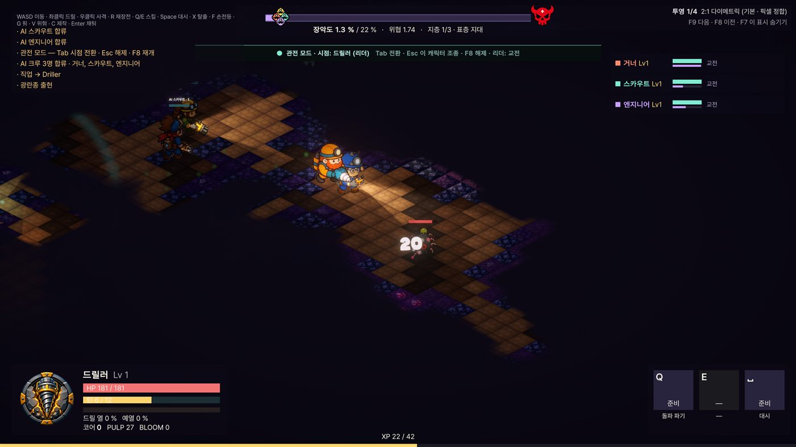
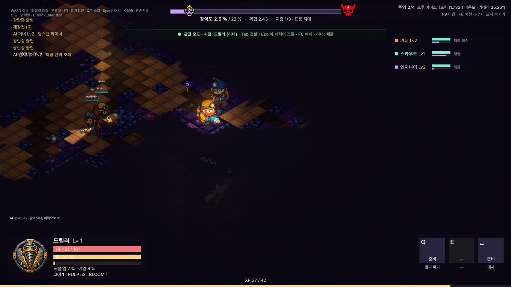
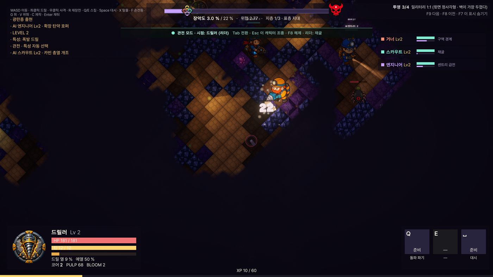
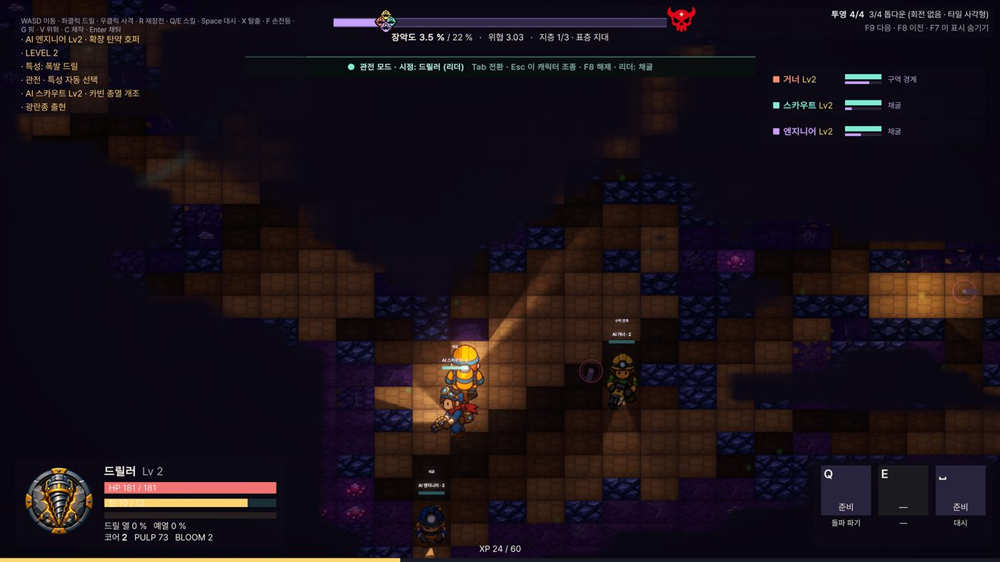

# 투영 프리셋 (아이소메트릭 비교 도구)

*2026-09-08 · Unity 프로젝트(`unity/TunnelCrew/`)*

현재 화면은 2:1 마름모 아이소메트릭이다. "정사각형 각도로도 아이소메트릭이 되는가"를
말로 답하는 대신 **플레이하면서 눈으로 비교**할 수 있게 투영 프리셋 4종을 넣었다.
시뮬레이션에는 손대지 않는다 — 바뀌는 것은 화면 좌표뿐이라 이동·충돌·길찾기·리플레이 결과는
프리셋과 무관하게 동일하다.

## 조작

| 키 | 동작 |
|---|---|
| **F9** | 다음 프리셋 |
| **F8** | 이전 프리셋 |
| **F7** | 우측 상단 라벨 숨기기 / 보이기 |

- 고른 프리셋은 `PlayerPrefs("tc.projectionPreset")` 에 남아 다음 실행에도 유지된다.
- 기본값은 **2:1 다이메트릭**이고, 종전 코드와 수치까지 동일하다(hw 0.5 · hh 0.25).
- 비교는 메인 메뉴의 `6 관전 모드`(4직업 완전 자동)에서 하면 조작 없이 네 화면을 볼 수 있다.

## 프리셋 4종

투영은 "1셀 = 가로 1유닛"을 고정하고 **세로 반높이(hh)만** 바꾼다.
`카메라 각도`는 같은 그림을 3D 카메라로 만들 때의 피치이고, 괄호는 화면상 타일 변의 기울기다.

| # | 프리셋 | 타일 모양 | hh | 카메라 각도 | 성격 |
|---|---|---|---|---|---|
| 1 | `Dimetric2To1` | 마름모 2:1 | 0.25 | 30° (변 26.57°) | **기본값.** 픽셀 계단이 2:1 로 맞아 도트 자산의 표준 |
| 2 | `TrueIsometric` | 마름모 1.732:1 | 0.2887 | 35.26° (변 30°) | 3축 각도·축척이 모두 같은 정통 아이소메트릭 |
| 3 | `Military1To1` | 마름모 1:1 | 0.5 | 압축 없음 | 윗면이 **왜곡 없는 정사각형**. 벽이 가장 두껍고 묵직하게 보인다 |
| 4 | `ThreeQuarter` | 축 정렬 사각형 | 0.3 | 회전 없음 | 45° 회전을 없앤 3/4 톱다운(젤다·스타듀 계열) |

"타일을 정사각형으로 보이게" 하는 방법은 3번과 4번 둘뿐이다. 45° 회전 + 세로 압축이
있는 한 타일은 반드시 마름모가 되고, 3번은 *돌리되 누르지 않아* 타일 자체가 정사각형으로
남는 쪽, 4번은 *돌리지 않는* 쪽이다.

### 1 · 2:1 다이메트릭 (기본)

### 2 · 트루 아이소메트릭

### 3 · 밀리터리 1:1

### 4 · 3/4 톱다운

## 구현

| 파일 | 역할 |
|---|---|
| `Presentation/World/IsometricProjection.cs` | 프리셋별 수치, 정·역변환, 경계, 타일 그리드 Transform, `Changed` 이벤트 |
| `Presentation/World/ProjectionSwitcher.cs` | 단축키·라벨·PlayerPrefs. `RunBootstrap.Start()` 이 한 줄로 붙인다 |

투영값은 `IsometricProjection` 한 곳에만 있다. 매 프레임 `ToRender` 를 부르는 뷰(크루·적·전투·
루트·핑·시네마틱·카메라)는 프리셋을 바꾸면 그대로 따라오므로 손댈 것이 없고, **한 번 계산해
캐시해 두는 세 곳만** `Changed` 로 다시 만든다.

1. **타일 그리드 Transform** — 마름모 계열은 `45°` 회전 + `(hw·√2, hh·√2)` 스케일,
   3/4 톱다운은 회전 없이 `(2hw, 2hh)` 스케일. `ConfigureTileGrid` 가 만든 루트를 기억해 두고 다시 맞춘다.
2. **벽 그림자** — `WallShadowBuilder` 의 `ShadowCaster2D` 사각형이 렌더 좌표라 전량 재생성한다.
3. **카메라 추종 원점** — `CameraRig._camOrigin` 이 옛 좌표계 값이라 한 프레임 튄다. 추종을 다시 잡는다.

`Darkness.shader` 는 렌더 좌표를 시뮬 좌표로 되돌려 LOS 텍스처를 읽는데, 이 역변환이
`((x-y)·.5, (x+y)·.25)` 기준으로 하드코딩돼 있었다. `IsometricProjection.InverseRow()` 가 주는
`_InvProj (a,b,c,d)` 로 넘겨받게 바꿔서 3/4 톱다운에서도 시야 마스크가 타일과 정확히 맞는다.

발밑 그림자 눌림도 `IsometricProjection.ShadowSquash` 에서 가져온다(2:1 에서는 종전과 같은 0.55).

## 검증 (2026-09-08)

- Unity 6.3 LTS 에디터 플레이 모드, 관전 모드 런에서 프리셋 4종을 전환하며 캡처 — 위 이미지.
- 타일·크루·적·시야 어둠·카메라 추종이 네 프리셋에서 모두 어긋남 없이 따라온다.
- `SetPreset` 왕복 후 기본값 복귀 확인, 프리셋별 hw/hh/역행렬 값 로그 확인.

## 한계와 다음 판단

- 지금 타일 스프라이트는 **2:1 마름모로 그려진 그림**이다. 프리셋 2~4 에서는 그 그림이
  늘어나거나 눌려 보이므로, 지금 비교로 알 수 있는 것은 *형태와 밀도의 인상*까지다.
  최종 채택 판단은 해당 비율로 타일을 다시 뽑은 뒤에 한다.
- 채택 시 따라오는 작업: 타일 아틀라스 재생성(`BuildArtAssets`), 벽 노멀맵 재생성,
  캐릭터 8방향 시트의 방향 각도 재검토, `SimTuning` 의 카메라 줌·데드존 재보정.
- 프리셋을 하나로 확정하면 `ProjectionSwitcher` 는 빼고 `IsometricProjection` 의 기본값만 남긴다.
